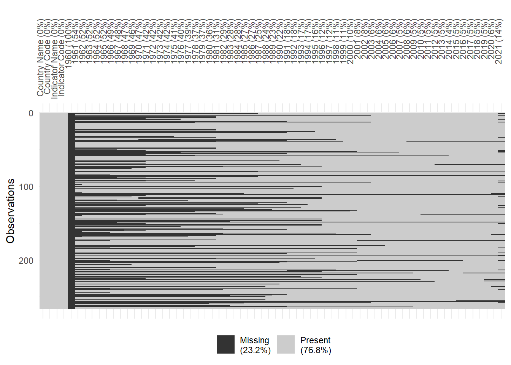

## Domain problem formulation


## Data source overview

## Step 1: Review background information {#sec-bg-info}

Based on the things on the website of "Historical public depth data set":
The historical public debt database is the first truly comprehensive database on gross government debt-to-GDP produced and maintained by the Fiscal Department at the IMF. It provides a public good to macro practitioners by publishing electronically the database and being transparent about the data sources and references.

GDP stands for Gross Domestic Product. It is the total monetary value of all goods and services produced within a country’s borders in a specific time period (usually a year or a quarter).

In simpler terms, GDP measures the economic activity and size of a country’s economy. A higher GDP generally means a larger or more productive economy.
In Gdp data set we have the growth rate which is:
$$\frac{\textbf{GDP of current year}-\textbf{GDP of last year}}{GDP of last year}\times 100$$
And the unit for debt is usually expressed as trillions of the currency of that contry of we can transform it to USD for a more consistent data set. 
Sometimes it is shown as debt to GDP ratio which makes more sound here because the debt of united states in 2015 was 18.7\$ trillion of dollar and debt to GDP ratio was 105% which is the number that is displayed in the data set.
### Data dictionary


## Step 2: Loading in the data


```r
library(readr)
```

```
## Warning: package 'readr' was built under R version 4.2.3
```

```r
growth_raw <- read_csv(
  "E:/growth_original.csv",
  skip = 0,               # skip metadata rows if any
  col_types = cols(.default = col_double(), 
                   `Country Name` = col_character(),
                   `Country Code` = col_character(),
                   `Indicator Name` = col_character(),
                   `Indicator Code` = col_character()),
  na = c("", "NA")
)

head(growth_raw)
```

```
## # A tibble: 6 × 66
##   `Country Name`   `Country Code` `Indicator Name` `Indicator Code` `1960` `1961` `1962` `1963`
##   <chr>            <chr>          <chr>            <chr>             <dbl>  <dbl>  <dbl>  <dbl>
## 1 Aruba            ABW            GDP growth (ann… NY.GDP.MKTP.KD.…     NA NA      NA     NA   
## 2 Africa Eastern … AFE            GDP growth (ann… NY.GDP.MKTP.KD.…     NA  0.240   7.98   5.16
## 3 Afghanistan      AFG            GDP growth (ann… NY.GDP.MKTP.KD.…     NA NA      NA     NA   
## 4 Africa Western … AFW            GDP growth (ann… NY.GDP.MKTP.KD.…     NA  1.85    3.77   7.27
## 5 Angola           AGO            GDP growth (ann… NY.GDP.MKTP.KD.…     NA NA      NA     NA   
## 6 Albania          ALB            GDP growth (ann… NY.GDP.MKTP.KD.…     NA NA      NA     NA   
## # ℹ 58 more variables: `1964` <dbl>, `1965` <dbl>, `1966` <dbl>, `1967` <dbl>, `1968` <dbl>,
## #   `1969` <dbl>, `1970` <dbl>, `1971` <dbl>, `1972` <dbl>, `1973` <dbl>, `1974` <dbl>,
## #   `1975` <dbl>, `1976` <dbl>, `1977` <dbl>, `1978` <dbl>, `1979` <dbl>, `1980` <dbl>,
## #   `1981` <dbl>, `1982` <dbl>, `1983` <dbl>, `1984` <dbl>, `1985` <dbl>, `1986` <dbl>,
## #   `1987` <dbl>, `1988` <dbl>, `1989` <dbl>, `1990` <dbl>, `1991` <dbl>, `1992` <dbl>,
## #   `1993` <dbl>, `1994` <dbl>, `1995` <dbl>, `1996` <dbl>, `1997` <dbl>, `1998` <dbl>,
## #   `1999` <dbl>, `2000` <dbl>, `2001` <dbl>, `2002` <dbl>, `2003` <dbl>, `2004` <dbl>, …
```

```r
library(readr)

debt_raw <- read_csv(
  "E:/debt_original.csv",
  skip = 0,               # skip metadata rows if any
  na = c("", "NA")
)
```

```
## Rows: 194 Columns: 217
## ── Column specification ───────────────────────────────────────────────────────────────────────
## Delimiter: ","
## chr (217): DEBT (% of GDP), 1800, 1801, 1802, 1803, 1804, 1805, 1806, 1807, 1808, 1809, 181...
## 
## ℹ Use `spec()` to retrieve the full column specification for this data.
## ℹ Specify the column types or set `show_col_types = FALSE` to quiet this message.
```

```r
head(debt_raw, 50)
```

```
## # A tibble: 50 × 217
##    `DEBT (% of GDP)`   `1800`  `1801`  `1802`  `1803` `1804` `1805` `1806` `1807` `1808` `1809`
##    <chr>               <chr>   <chr>   <chr>   <chr>  <chr>  <chr>  <chr>  <chr>  <chr>  <chr> 
##  1 Afghanistan         no data no data no data no da… no da… no da… no da… no da… no da… no da…
##  2 Albania             no data no data no data no da… no da… no da… no da… no da… no da… no da…
##  3 Algeria             no data no data no data no da… no da… no da… no da… no da… no da… no da…
##  4 Angola              no data no data no data no da… no da… no da… no da… no da… no da… no da…
##  5 Anguilla            no data no data no data no da… no da… no da… no da… no da… no da… no da…
##  6 Antigua and Barbuda no data no data no data no da… no da… no da… no da… no da… no da… no da…
##  7 Argentina           no data no data no data no da… no da… no da… no da… no da… no da… no da…
##  8 Armenia             no data no data no data no da… no da… no da… no da… no da… no da… no da…
##  9 Australia           no data no data no data no da… no da… no da… no da… no da… no da… no da…
## 10 Austria             no data no data no data no da… no da… no da… no da… no da… no da… no da…
## # ℹ 40 more rows
## # ℹ 206 more variables: `1810` <chr>, `1811` <chr>, `1812` <chr>, `1813` <chr>, `1814` <chr>,
## #   `1815` <chr>, `1816` <chr>, `1817` <chr>, `1818` <chr>, `1819` <chr>, `1820` <chr>,
## #   `1821` <chr>, `1822` <chr>, `1823` <chr>, `1824` <chr>, `1825` <chr>, `1826` <chr>,
## #   `1827` <chr>, `1828` <chr>, `1829` <chr>, `1830` <chr>, `1831` <chr>, `1832` <chr>,
## #   `1833` <chr>, `1834` <chr>, `1835` <chr>, `1836` <chr>, `1837` <chr>, `1838` <chr>,
## #   `1839` <chr>, `1840` <chr>, `1841` <chr>, `1842` <chr>, `1843` <chr>, `1844` <chr>, …
```

```r
head(debt_raw)
```

```
## # A tibble: 6 × 217
##   `DEBT (% of GDP)`   `1800`  `1801`  `1802`  `1803`  `1804` `1805` `1806` `1807` `1808` `1809`
##   <chr>               <chr>   <chr>   <chr>   <chr>   <chr>  <chr>  <chr>  <chr>  <chr>  <chr> 
## 1 Afghanistan         no data no data no data no data no da… no da… no da… no da… no da… no da…
## 2 Albania             no data no data no data no data no da… no da… no da… no da… no da… no da…
## 3 Algeria             no data no data no data no data no da… no da… no da… no da… no da… no da…
## 4 Angola              no data no data no data no data no da… no da… no da… no da… no da… no da…
## 5 Anguilla            no data no data no data no data no da… no da… no da… no da… no da… no da…
## 6 Antigua and Barbuda no data no data no data no data no da… no da… no da… no da… no da… no da…
## # ℹ 206 more variables: `1810` <chr>, `1811` <chr>, `1812` <chr>, `1813` <chr>, `1814` <chr>,
## #   `1815` <chr>, `1816` <chr>, `1817` <chr>, `1818` <chr>, `1819` <chr>, `1820` <chr>,
## #   `1821` <chr>, `1822` <chr>, `1823` <chr>, `1824` <chr>, `1825` <chr>, `1826` <chr>,
## #   `1827` <chr>, `1828` <chr>, `1829` <chr>, `1830` <chr>, `1831` <chr>, `1832` <chr>,
## #   `1833` <chr>, `1834` <chr>, `1835` <chr>, `1836` <chr>, `1837` <chr>, `1838` <chr>,
## #   `1839` <chr>, `1840` <chr>, `1841` <chr>, `1842` <chr>, `1843` <chr>, `1844` <chr>,
## #   `1845` <chr>, `1846` <chr>, `1847` <chr>, `1848` <chr>, `1849` <chr>, `1850` <chr>, …
```


```r
colnames(debt_raw)
```

```
##   [1] "DEBT (% of GDP)" "1800"            "1801"            "1802"            "1803"           
##   [6] "1804"            "1805"            "1806"            "1807"            "1808"           
##  [11] "1809"            "1810"            "1811"            "1812"            "1813"           
##  [16] "1814"            "1815"            "1816"            "1817"            "1818"           
##  [21] "1819"            "1820"            "1821"            "1822"            "1823"           
##  [26] "1824"            "1825"            "1826"            "1827"            "1828"           
##  [31] "1829"            "1830"            "1831"            "1832"            "1833"           
##  [36] "1834"            "1835"            "1836"            "1837"            "1838"           
##  [41] "1839"            "1840"            "1841"            "1842"            "1843"           
##  [46] "1844"            "1845"            "1846"            "1847"            "1848"           
##  [51] "1849"            "1850"            "1851"            "1852"            "1853"           
##  [56] "1854"            "1855"            "1856"            "1857"            "1858"           
##  [61] "1859"            "1860"            "1861"            "1862"            "1863"           
##  [66] "1864"            "1865"            "1866"            "1867"            "1868"           
##  [71] "1869"            "1870"            "1871"            "1872"            "1873"           
##  [76] "1874"            "1875"            "1876"            "1877"            "1878"           
##  [81] "1879"            "1880"            "1881"            "1882"            "1883"           
##  [86] "1884"            "1885"            "1886"            "1887"            "1888"           
##  [91] "1889"            "1890"            "1891"            "1892"            "1893"           
##  [96] "1894"            "1895"            "1896"            "1897"            "1898"           
## [101] "1899"            "1900"            "1901"            "1902"            "1903"           
## [106] "1904"            "1905"            "1906"            "1907"            "1908"           
## [111] "1909"            "1910"            "1911"            "1912"            "1913"           
## [116] "1914"            "1915"            "1916"            "1917"            "1918"           
## [121] "1919"            "1920"            "1921"            "1922"            "1923"           
## [126] "1924"            "1925"            "1926"            "1927"            "1928"           
## [131] "1929"            "1930"            "1931"            "1932"            "1933"           
## [136] "1934"            "1935"            "1936"            "1937"            "1938"           
## [141] "1939"            "1940"            "1941"            "1942"            "1943"           
## [146] "1944"            "1945"            "1946"            "1947"            "1948"           
## [151] "1949"            "1950"            "1951"            "1952"            "1953"           
## [156] "1954"            "1955"            "1956"            "1957"            "1958"           
## [161] "1959"            "1960"            "1961"            "1962"            "1963"           
## [166] "1964"            "1965"            "1966"            "1967"            "1968"           
## [171] "1969"            "1970"            "1971"            "1972"            "1973"           
## [176] "1974"            "1975"            "1976"            "1977"            "1978"           
## [181] "1979"            "1980"            "1981"            "1982"            "1983"           
## [186] "1984"            "1985"            "1986"            "1987"            "1988"           
## [191] "1989"            "1990"            "1991"            "1992"            "1993"           
## [196] "1994"            "1995"            "1996"            "1997"            "1998"           
## [201] "1999"            "2000"            "2001"            "2002"            "2003"           
## [206] "2004"            "2005"            "2006"            "2007"            "2008"           
## [211] "2009"            "2010"            "2011"            "2012"            "2013"           
## [216] "2014"            "2015"
```


```r
colnames(growth_raw)
```

```
##  [1] "Country Name"   "Country Code"   "Indicator Name" "Indicator Code" "1960"          
##  [6] "1961"           "1962"           "1963"           "1964"           "1965"          
## [11] "1966"           "1967"           "1968"           "1969"           "1970"          
## [16] "1971"           "1972"           "1973"           "1974"           "1975"          
## [21] "1976"           "1977"           "1978"           "1979"           "1980"          
## [26] "1981"           "1982"           "1983"           "1984"           "1985"          
## [31] "1986"           "1987"           "1988"           "1989"           "1990"          
## [36] "1991"           "1992"           "1993"           "1994"           "1995"          
## [41] "1996"           "1997"           "1998"           "1999"           "2000"          
## [46] "2001"           "2002"           "2003"           "2004"           "2005"          
## [51] "2006"           "2007"           "2008"           "2009"           "2010"          
## [56] "2011"           "2012"           "2013"           "2014"           "2015"          
## [61] "2016"           "2017"           "2018"           "2019"           "2020"          
## [66] "2021"
```


```r
dim(debt_raw)
```

```
## [1] 194 217
```

```r
dim(growth_raw)
```

```
## [1] 266  66
```
As you see there are more countries as it should be:

```r
library(dplyr)
```

```
## Warning: package 'dplyr' was built under R version 4.2.3
```

```
## 
## Attaching package: 'dplyr'
```

```
## The following object is masked _by_ '.GlobalEnv':
## 
##     pick
```

```
## The following objects are masked from 'package:stats':
## 
##     filter, lag
```

```
## The following objects are masked from 'package:base':
## 
##     intersect, setdiff, setequal, union
```

```r
growth_raw |> 
  summarise(num_countries = n_distinct(`Country Name`))
```

```
## # A tibble: 1 × 1
##   num_countries
##           <int>
## 1           266
```
but the debt data set only shows exact number of countries. 

```r
debt_raw |> 
  summarise(num_countries = n_distinct(`DEBT (% of GDP)`))
```

```
## # A tibble: 1 × 1
##   num_countries
##           <int>
## 1           194
```
## Step 3: Examine the data and create action items

```r
library(purrr)

#| label: tbl-summary
#| tbl-cap: The minimum, mean, and maximum of each numeric variable
growth_raw |> 
  select(where(is.numeric)) |> 
  map_df(function(.col) { data.frame(min = min(.col, na.rm = TRUE),
                                     mean = mean(.col, na.rm = TRUE),
                                     max = max(.col, na.rm = TRUE)) },
         .id = "variable")
```

```
## Warning in min(.col, na.rm = TRUE): no non-missing arguments to min; returning Inf
```

```
## Warning in max(.col, na.rm = TRUE): no non-missing arguments to max; returning -Inf
```

```
##    variable        min       mean        max
## 1      1960        Inf        NaN       -Inf
## 2      1961 -27.270000  3.2696871  14.766843
## 3      1962 -19.685042  5.0392032  24.521297
## 4      1963 -12.278657  4.9070578  34.313729
## 5      1964 -12.464993  6.2866263  27.690886
## 6      1965 -12.481834  5.2557889  17.035712
## 7      1966  -7.659066  4.5955131  19.200000
## 8      1967 -15.743628  4.0787484  66.219084
## 9      1968  -5.474906  5.9310951  81.887797
## 10     1969  -6.554143  6.8670626  25.666169
## 11     1970  -5.649650  7.4772374  58.647331
## 12     1971 -11.331719  5.3641860  25.821107
## 13     1972 -13.973729  5.4365768  27.423969
## 14     1973 -17.047584  5.1078342  26.404881
## 15     1974 -18.266379  5.4083736  45.302754
## 16     1975 -14.803126  2.8785635  30.073699
## 17     1976 -26.768233  6.2495606  35.625338
## 18     1977 -12.582091  4.6667650  23.307491
## 19     1978 -24.049206  4.3104719  22.003005
## 20     1979 -26.478789  4.2082501  26.139296
## 21     1980 -21.599649  3.2490326  24.753727
## 22     1981 -19.826716  2.8606414  19.688334
## 23     1982 -20.729888  1.5336171  23.597700
## 24     1983 -16.051386  1.4434321  16.666671
## 25     1984 -16.819835  3.2551945  16.711594
## 26     1985 -11.144353  3.0622006  21.792774
## 27     1986 -14.958137  3.5949789  24.542499
## 28     1987 -17.146042  3.7435470  29.054324
## 29     1988 -13.379844  4.6036910  34.600001
## 30     1989 -42.451118  3.0335817  14.190637
## 31     1990 -14.788226  3.4313328  57.817828
## 32     1991 -64.047107  1.4520160  49.447379
## 33     1992 -44.899999  1.6532747  34.745320
## 34     1993 -29.300002  1.9827831  33.990468
## 35     1994 -50.248067  2.2510243  21.221411
## 36     1995 -12.416322  3.9098507  35.224078
## 37     1996 -16.699998  4.8393652  88.957666
## 38     1997 -14.115381  5.0295777 149.972963
## 39     1998 -28.099980  3.5158892  34.857095
## 40     1999  -9.424162  3.3008644  25.664015
## 41     2000 -14.276999  4.3508430  19.681270
## 42     2001  -9.310639  3.3266148  63.379875
## 43     2002 -12.489192  3.3327315  26.417317
## 44     2003 -36.658153  3.9218859  17.326020
## 45     2004  -5.807538  5.9701554  53.381794
## 46     2005 -13.129053  5.0562059  27.961538
## 47     2006  -6.871463  5.8399203  34.500000
## 48     2007 -22.857143  5.6970716  25.000000
## 49     2008 -17.668946  3.8926919  22.222222
## 50     2009 -17.573222  0.2148767  21.390528
## 51     2010  -8.924176  4.5578224  25.122823
## 52     2011 -50.338515  3.6672012  21.616588
## 53     2012 -46.082122  3.0925489  86.826748
## 54     2013 -36.391977  3.2196002  30.612245
## 55     2014 -23.042806  3.3219176  26.562500
## 56     2015 -27.994546  2.7700752  25.176245
## 57     2016 -10.783238  3.0736002  29.212121
## 58     2017  -6.987578  3.2735918  32.491802
## 59     2018 -19.345011  3.1039243   9.030161
## 60     2019 -11.195695  2.7652936  19.535810
## 61     2020 -54.011402 -4.6900473  43.479556
## 62     2021 -17.984742  5.0586314  31.372422
```
This shows that the data in debt data set is not recorded as numeric. so we need to change it.

```r
debt_raw <- debt_raw %>%
  mutate(across(-1, as.numeric))
```

```
## Warning: There were 216 warnings in `mutate()`.
## The first warning was:
## ℹ In argument: `across(-1, as.numeric)`.
## Caused by warning:
## ! NAs introduced by coercion
## ℹ Run `dplyr::last_dplyr_warnings()` to see the 215 remaining warnings.
```

```r
#| label: tbl-summary
#| tbl-cap: The minimum, mean, and maximum of each numeric variable
debt_raw |> 
  select(where(is.numeric)) |> 
  map_df(function(.col) { data.frame(min = min(.col, na.rm = TRUE),
                                     mean = mean(.col, na.rm = TRUE),
                                     max = max(.col, na.rm = TRUE)) },
         .id = "variable")
```

```
##     variable   min      mean     max
## 1       1800 18.08  81.67750  176.84
## 2       1801 15.72  81.00750  177.47
## 3       1802 16.47  85.50750  188.99
## 4       1803 15.80  85.91000  190.67
## 5       1804 16.18  85.06750  188.40
## 6       1805 13.90  82.78750  189.07
## 7       1806 12.43  82.48750  192.64
## 8       1807 12.27  82.22000  193.88
## 9       1808 14.14  81.60750  191.51
## 10      1809 11.35  80.60000  188.99
## 11      1810  9.90  79.76750  186.69
## 12      1811  8.28  76.96000  182.51
## 13      1812  7.94  77.14250  188.11
## 14      1813  8.99  80.53500  196.74
## 15      1814 11.63 100.55000  219.62
## 16      1815 11.49 101.58200  226.31
## 17      1816 10.93 104.21400  237.32
## 18      1817 10.34  99.95800  231.09
## 19      1818  9.38 111.44200  259.04
## 20      1819  8.94 116.93000  260.29
## 21      1820  9.04 117.85400  259.95
## 22      1821  9.21 120.82600  260.34
## 23      1822  9.20 117.80600  246.73
## 24      1823  6.80 113.16000  237.29
## 25      1824  6.54 113.87200  224.80
## 26      1825  6.27 107.02600  212.72
## 27      1826  5.78 105.89600  208.34
## 28      1827  5.26 100.48400  196.41
## 29      1828  5.44  98.99400  203.99
## 30      1829  3.43  94.41400  198.64
## 31      1830  3.86  98.90200  210.48
## 32      1831  3.64  94.66200  196.88
## 33      1832  2.10  97.36600  198.79
## 34      1833  0.54 105.29800  236.65
## 35      1834  0.36 103.50000  246.76
## 36      1835  3.87 144.47000  244.97
## 37      1836  3.58 134.53500  223.14
## 38      1837  0.02  96.80600  235.94
## 39      1838  0.19  90.94400  223.79
## 40      1839  0.54  86.11400  212.34
## 41      1840  0.21  90.15600  216.31
## 42      1841  0.30  92.91800  215.24
## 43      1842  0.81  97.13200  222.26
## 44      1843  2.00  99.98400  234.88
## 45      1844  1.30  96.73000  243.88
## 46      1845  0.81  89.07800  221.13
## 47      1846  0.76  79.26200  189.36
## 48      1847  1.66  74.25600  171.26
## 49      1848  1.98  82.26600  200.55
## 50      1849  2.66  82.20800  201.62
## 51      1850  2.36  85.95600  200.90
## 52      1851  2.52  73.72667  196.73
## 53      1852  2.20  71.27667  188.49
## 54      1853  1.74  68.38667  185.03
## 55      1854  1.09  63.03500  158.32
## 56      1855  0.88  61.94167  160.33
## 57      1856  0.76  59.11833  145.33
## 58      1857  0.66  59.83000  145.19
## 59      1858  1.10  62.77500  156.15
## 60      1859  1.36  61.34000  156.30
## 61      1860  1.44  51.95857  139.99
## 62      1861  1.94  46.68875  135.72
## 63      1862  6.46  45.88750  121.60
## 64      1863  5.67  48.17625  119.93
## 65      1864  8.23  50.74250  113.50
## 66      1865  9.42  54.66500  112.70
## 67      1866 11.05  54.12000  103.97
## 68      1867 11.56  58.80250  106.12
## 69      1868 13.31  58.64375  106.35
## 70      1869 13.12  60.89750  102.71
## 71      1870 12.67  54.94667  100.10
## 72      1871 12.35  55.26333   96.94
## 73      1872 10.97  51.58111   88.76
## 74      1873  9.25  47.62556   79.71
## 75      1874  9.26  48.88667   81.70
## 76      1875 10.31  46.84900   89.78
## 77      1876 10.17  49.49400  101.31
## 78      1877 12.92  53.49000   91.36
## 79      1878 16.70  54.58300   97.15
## 80      1879 17.54  54.87700   98.58
## 81      1880 15.77  61.33632  161.72
## 82      1881 15.54  61.81053  149.13
## 83      1882 13.81  59.57105  115.48
## 84      1883 13.77  57.83526  116.33
## 85      1884 13.29  59.18143  120.74
## 86      1885 12.95  60.06227  112.57
## 87      1886 11.59  61.03864  116.65
## 88      1887 10.59  63.44136  123.06
## 89      1888 10.14  65.42136  126.35
## 90      1889  8.59  64.45000  129.87
## 91      1890  7.73  64.64091  134.08
## 92      1891  6.46  64.54227  144.15
## 93      1892  6.18  67.56182  152.54
## 94      1893  6.32  67.06636  161.58
## 95      1894  7.46  70.28455  216.98
## 96      1895  7.09  69.66955  193.26
## 97      1896  7.99  70.32545  223.50
## 98      1897  7.70  66.97500  190.71
## 99      1898  7.43  63.82818  181.00
## 100     1899  3.56  61.71217  190.69
## 101     1900  3.63  60.50304  218.06
## 102     1901  3.41  64.37042  205.45
## 103     1902  3.33  64.25125  209.32
## 104     1903  4.09  61.95500  194.54
## 105     1904  3.47  61.38292  189.62
## 106     1905  3.30  62.07708  164.13
## 107     1906  3.04  58.73875  148.95
## 108     1907  2.69  54.09417  123.19
## 109     1908  2.92  55.02083  129.66
## 110     1909  3.45  54.75375  124.61
## 111     1910  3.17  53.63750  119.58
## 112     1911  2.90  49.98458  121.78
## 113     1912  2.84  47.95833  123.43
## 114     1913  2.70  47.15833  120.07
## 115     1914  3.47  43.96941  118.58
## 116     1915  3.31  47.14500  106.01
## 117     1916  2.74  46.90500  102.65
## 118     1917  5.72  51.99263  116.52
## 119     1918  5.98  50.88600  128.11
## 120     1919  5.28  54.01400  142.77
## 121     1920  4.35  54.74217  169.57
## 122     1921  5.42  63.49435  237.03
## 123     1922  5.87  68.54565  235.88
## 124     1923  6.73  64.77320  216.82
## 125     1924  6.75  59.85966  192.41
## 126     1925  4.17  55.75962  197.19
## 127     1926  4.40  50.26448  187.12
## 128     1927  4.22  53.27600  177.45
## 129     1928  3.63  51.72742  175.78
## 130     1929  2.59  49.07829  170.52
## 131     1930  2.05  53.69000  171.00
## 132     1931  1.43  60.29471  190.18
## 133     1932  1.24  66.55000  233.13
## 134     1933  1.31  64.53343  246.56
## 135     1934  1.21  60.42000  235.98
## 136     1935  1.03  57.17636  205.07
## 137     1936  0.15  52.06278  179.97
## 138     1937  0.13  47.60857  158.69
## 139     1938  0.12  46.94030  155.08
## 140     1939  0.12  45.75029  149.68
## 141     1940  0.11  43.15355  128.07
## 142     1941  0.04  49.07250  173.45
## 143     1942  0.04  46.57194  153.20
## 144     1943  0.30  56.14750  225.14
## 145     1944  0.70  56.84966  203.95
## 146     1945  0.57  52.49724  234.69
## 147     1946  0.42  66.58893  269.80
## 148     1947  0.07  61.34308  264.12
## 149     1948  0.08  50.24759  239.57
## 150     1949  0.08  48.74966  220.27
## 151     1950  0.08  42.49625  216.92
## 152     1951  0.11  39.02533  196.76
## 153     1952  0.05  35.94963  180.86
## 154     1953  0.33  30.82410  169.76
## 155     1954  2.77  30.86023  163.23
## 156     1955  0.20  29.05227  154.19
## 157     1956  0.15  28.66628  143.76
## 158     1957  0.11  28.46692  135.73
## 159     1958  0.09  29.01405  131.13
## 160     1959  3.22  30.90941  124.87
## 161     1960  2.83  26.44804  117.94
## 162     1961  2.53  26.62681  113.75
## 163     1962  5.74  26.98711  110.52
## 164     1963  4.52  26.86913  108.55
## 165     1964  3.81  25.47326  101.08
## 166     1965  5.16  25.04587   94.61
## 167     1966  4.44  26.40404   91.95
## 168     1967  3.74  26.74740   89.15
## 169     1968  2.76  26.76566   88.55
## 170     1969  2.63  27.55189   82.84
## 171     1970  1.78  28.28220  136.45
## 172     1971  0.00  28.50510  113.98
## 173     1972  0.02  29.37873  127.15
## 174     1973  0.06  27.60000  145.29
## 175     1974  0.11  27.03486  126.32
## 176     1975  0.18  29.09298  176.77
## 177     1976  0.32  31.16748  234.28
## 178     1977  0.37  35.20069  272.19
## 179     1978  0.47  38.57930  264.42
## 180     1979  0.51  40.13750  299.84
## 181     1980  0.61  41.89392  318.93
## 182     1981  2.51  45.20877  357.50
## 183     1982  1.72  53.42333  509.33
## 184     1983  3.49  61.92150  598.30
## 185     1984  0.97  63.76310  610.20
## 186     1985  3.31  68.63672  664.52
## 187     1986  3.24  70.79195  717.72
## 188     1987  3.60  75.64215  615.25
## 189     1988  2.18  75.01374  629.19
## 190     1989  4.00  74.66046  602.46
## 191     1990  1.03  90.38985 2092.92
## 192     1991  2.70  77.20708  784.35
## 193     1992  4.79  81.17151  711.94
## 194     1993  5.99  79.17783  624.64
## 195     1994  5.50  78.48771  526.81
## 196     1995  7.11  72.92639  447.72
## 197     1996  5.90  68.94053  322.37
## 198     1997  4.84  65.43041  316.00
## 199     1998  5.45  72.53545  434.91
## 200     1999  4.82  74.73830  385.58
## 201     2000  3.09  72.97450  376.04
## 202     2001  2.69  72.27751  388.40
## 203     2002  1.96  73.22973  367.72
## 204     2003  0.98  71.08799  523.38
## 205     2004  0.41  67.33846  487.45
## 206     2005  0.32  59.73228  402.44
## 207     2006  0.98  51.43859  357.74
## 208     2007  0.69  44.62447  183.01
## 209     2008  0.47  44.61026  309.66
## 210     2009  0.68  47.38230  210.25
## 211     2010  0.63  46.72204  215.82
## 212     2011  0.58  47.23411  231.63
## 213     2012  0.55  48.19529  238.01
## 214     2013  0.53  49.81382  244.48
## 215     2014  0.07  51.68188  249.11
## 216     2015  0.06  54.73513  247.98
```


```r
library(tidyr)

#| label: tbl-missing-cols
#| tbl-cap: "The number of missing rows in each column"
#| warning: false
#| message: false
growth_raw |> 
  summarise(across(everything(), ~sum(is.na(.)))) |>
  pivot_longer(everything(), names_to = "variable", values_to = "missing_rows") |>
  mutate(prop_missing = missing_rows / nrow(growth_raw)) |>
  arrange(missing_rows)
```

```
## # A tibble: 66 × 3
##    variable       missing_rows prop_missing
##    <chr>                 <int>        <dbl>
##  1 Country Name              0       0     
##  2 Country Code              0       0     
##  3 Indicator Name            0       0     
##  4 Indicator Code            0       0     
##  5 2014                     11       0.0414
##  6 2015                     12       0.0451
##  7 2016                     12       0.0451
##  8 2017                     12       0.0451
##  9 2018                     12       0.0451
## 10 2009                     13       0.0489
## # ℹ 56 more rows
```
There are many missing data in the debt data set specially in the intial years.

```r
debt_raw |> 
  summarise(across(everything(), ~sum(is.na(.)))) |>
  pivot_longer(everything(), names_to = "variable", values_to = "missing_rows") |>
  mutate(prop_missing = missing_rows / nrow(debt_raw)) |>
  arrange(missing_rows)
```

```
## # A tibble: 217 × 3
##    variable        missing_rows prop_missing
##    <chr>                  <int>        <dbl>
##  1 DEBT (% of GDP)            0       0     
##  2 2006                       3       0.0155
##  3 2008                       3       0.0155
##  4 2009                       3       0.0155
##  5 2010                       3       0.0155
##  6 2012                       3       0.0155
##  7 2013                       3       0.0155
##  8 2014                       3       0.0155
##  9 2015                       3       0.0155
## 10 2007                       4       0.0206
## # ℹ 207 more rows
```


```r
library(naniar)
library(ggplot2)
```

```
## Warning: package 'ggplot2' was built under R version 4.2.3
```

```r
vis_miss(debt_raw) + 
  theme(axis.text.x = element_text(angle = 90, hjust = 1))
```


```r
vis_miss(growth_raw) + 
  theme(axis.text.x = element_text(angle = 90, hjust = 1))
```


### Finding invalid values


### Assessing Column names
Column names were already pretty human friendly but we try to make it better:

```r
library(janitor)
```

```
## 
## Attaching package: 'janitor'
```

```
## The following objects are masked from 'package:stats':
## 
##     chisq.test, fisher.test
```

```r
growth_raw <- growth_raw |> clean_names()
debt_raw   <- debt_raw   |> clean_names()
colnames(growth_raw)
```

```
##  [1] "country_name"   "country_code"   "indicator_name" "indicator_code" "x1960"         
##  [6] "x1961"          "x1962"          "x1963"          "x1964"          "x1965"         
## [11] "x1966"          "x1967"          "x1968"          "x1969"          "x1970"         
## [16] "x1971"          "x1972"          "x1973"          "x1974"          "x1975"         
## [21] "x1976"          "x1977"          "x1978"          "x1979"          "x1980"         
## [26] "x1981"          "x1982"          "x1983"          "x1984"          "x1985"         
## [31] "x1986"          "x1987"          "x1988"          "x1989"          "x1990"         
## [36] "x1991"          "x1992"          "x1993"          "x1994"          "x1995"         
## [41] "x1996"          "x1997"          "x1998"          "x1999"          "x2000"         
## [46] "x2001"          "x2002"          "x2003"          "x2004"          "x2005"         
## [51] "x2006"          "x2007"          "x2008"          "x2009"          "x2010"         
## [56] "x2011"          "x2012"          "x2013"          "x2014"          "x2015"         
## [61] "x2016"          "x2017"          "x2018"          "x2019"          "x2020"         
## [66] "x2021"
```

```r
colnames(debt_raw)
```

```
##   [1] "debt_percent_of_gdp" "x1800"               "x1801"               "x1802"              
##   [5] "x1803"               "x1804"               "x1805"               "x1806"              
##   [9] "x1807"               "x1808"               "x1809"               "x1810"              
##  [13] "x1811"               "x1812"               "x1813"               "x1814"              
##  [17] "x1815"               "x1816"               "x1817"               "x1818"              
##  [21] "x1819"               "x1820"               "x1821"               "x1822"              
##  [25] "x1823"               "x1824"               "x1825"               "x1826"              
##  [29] "x1827"               "x1828"               "x1829"               "x1830"              
##  [33] "x1831"               "x1832"               "x1833"               "x1834"              
##  [37] "x1835"               "x1836"               "x1837"               "x1838"              
##  [41] "x1839"               "x1840"               "x1841"               "x1842"              
##  [45] "x1843"               "x1844"               "x1845"               "x1846"              
##  [49] "x1847"               "x1848"               "x1849"               "x1850"              
##  [53] "x1851"               "x1852"               "x1853"               "x1854"              
##  [57] "x1855"               "x1856"               "x1857"               "x1858"              
##  [61] "x1859"               "x1860"               "x1861"               "x1862"              
##  [65] "x1863"               "x1864"               "x1865"               "x1866"              
##  [69] "x1867"               "x1868"               "x1869"               "x1870"              
##  [73] "x1871"               "x1872"               "x1873"               "x1874"              
##  [77] "x1875"               "x1876"               "x1877"               "x1878"              
##  [81] "x1879"               "x1880"               "x1881"               "x1882"              
##  [85] "x1883"               "x1884"               "x1885"               "x1886"              
##  [89] "x1887"               "x1888"               "x1889"               "x1890"              
##  [93] "x1891"               "x1892"               "x1893"               "x1894"              
##  [97] "x1895"               "x1896"               "x1897"               "x1898"              
## [101] "x1899"               "x1900"               "x1901"               "x1902"              
## [105] "x1903"               "x1904"               "x1905"               "x1906"              
## [109] "x1907"               "x1908"               "x1909"               "x1910"              
## [113] "x1911"               "x1912"               "x1913"               "x1914"              
## [117] "x1915"               "x1916"               "x1917"               "x1918"              
## [121] "x1919"               "x1920"               "x1921"               "x1922"              
## [125] "x1923"               "x1924"               "x1925"               "x1926"              
## [129] "x1927"               "x1928"               "x1929"               "x1930"              
## [133] "x1931"               "x1932"               "x1933"               "x1934"              
## [137] "x1935"               "x1936"               "x1937"               "x1938"              
## [141] "x1939"               "x1940"               "x1941"               "x1942"              
## [145] "x1943"               "x1944"               "x1945"               "x1946"              
## [149] "x1947"               "x1948"               "x1949"               "x1950"              
## [153] "x1951"               "x1952"               "x1953"               "x1954"              
## [157] "x1955"               "x1956"               "x1957"               "x1958"              
## [161] "x1959"               "x1960"               "x1961"               "x1962"              
## [165] "x1963"               "x1964"               "x1965"               "x1966"              
## [169] "x1967"               "x1968"               "x1969"               "x1970"              
## [173] "x1971"               "x1972"               "x1973"               "x1974"              
## [177] "x1975"               "x1976"               "x1977"               "x1978"              
## [181] "x1979"               "x1980"               "x1981"               "x1982"              
## [185] "x1983"               "x1984"               "x1985"               "x1986"              
## [189] "x1987"               "x1988"               "x1989"               "x1990"              
## [193] "x1991"               "x1992"               "x1993"               "x1994"              
## [197] "x1995"               "x1996"               "x1997"               "x1998"              
## [201] "x1999"               "x2000"               "x2001"               "x2002"              
## [205] "x2003"               "x2004"               "x2005"               "x2006"              
## [209] "x2007"               "x2008"               "x2009"               "x2010"              
## [213] "x2011"               "x2012"               "x2013"               "x2014"              
## [217] "x2015"
```
I think this command make the data set less understandable. 


### Assessing variable type
We already change the data recorded in debt_raw to numeric. 

```r
str(growth_raw)
```

```
## spc_tbl_ [266 × 66] (S3: spec_tbl_df/tbl_df/tbl/data.frame)
##  $ country_name  : chr [1:266] "Aruba" "Africa Eastern and Southern" "Afghanistan" "Africa Western and Central" ...
##  $ country_code  : chr [1:266] "ABW" "AFE" "AFG" "AFW" ...
##  $ indicator_name: chr [1:266] "GDP growth (annual %)" "GDP growth (annual %)" "GDP growth (annual %)" "GDP growth (annual %)" ...
##  $ indicator_code: chr [1:266] "NY.GDP.MKTP.KD.ZG" "NY.GDP.MKTP.KD.ZG" "NY.GDP.MKTP.KD.ZG" "NY.GDP.MKTP.KD.ZG" ...
##  $ x1960         : num [1:266] NA NA NA NA NA NA NA NA NA NA ...
##  $ x1961         : num [1:266] NA 0.24 NA 1.85 NA ...
##  $ x1962         : num [1:266] NA 7.98 NA 3.77 NA ...
##  $ x1963         : num [1:266] NA 5.16 NA 7.27 NA ...
##  $ x1964         : num [1:266] NA 4.58 NA 5.4 NA ...
##  $ x1965         : num [1:266] NA 5.33 NA 4.05 NA ...
##  $ x1966         : num [1:266] NA 3.91 NA -1.79 NA ...
##  $ x1967         : num [1:266] NA 5.26 NA -9.55 NA ...
##  $ x1968         : num [1:266] NA 4.02 NA 1.47 NA ...
##  $ x1969         : num [1:266] NA 5.28 NA 15.49 NA ...
##  $ x1970         : num [1:266] NA 4.7 NA 17.9 NA ...
##  $ x1971         : num [1:266] NA 5.37 NA 10.81 NA ...
##  $ x1972         : num [1:266] NA 2.15 NA 3.15 NA ...
##  $ x1973         : num [1:266] NA 4.44 NA 4.21 NA ...
##  $ x1974         : num [1:266] NA 5.89 NA 10.25 NA ...
##  $ x1975         : num [1:266] NA 1.73 NA -2.16 NA ...
##  $ x1976         : num [1:266] NA 2.85 NA 8.58 NA ...
##  $ x1977         : num [1:266] NA 1.23 NA 4.73 NA ...
##  $ x1978         : num [1:266] NA 1.03 NA -2.19 NA ...
##  $ x1979         : num [1:266] NA 2.8 NA 5.23 NA ...
##  $ x1980         : num [1:266] NA 5.42 NA 2 NA ...
##  $ x1981         : num [1:266] NA 4.33 NA -6.93 -4.4 ...
##  $ x1982         : num [1:266] NA 0.508 NA -3.35 0 ...
##  $ x1983         : num [1:266] NA 0.152 NA -6.534 4.2 ...
##  $ x1984         : num [1:266] NA 3.006 NA 0.559 6 ...
##  $ x1985         : num [1:266] NA -0.448 NA 5.552 3.5 ...
##  $ x1986         : num [1:266] NA 2.29 NA 1.41 2.9 ...
##  $ x1987         : num [1:266] 16.08 4.23 NA 1.45 4.08 ...
##  $ x1988         : num [1:266] 18.65 4 NA 4.84 6.13 ...
##  $ x1989         : num [1:266] 12.1298 2.8976 NA 2.2721 0.0416 ...
##  $ x1990         : num [1:266] 3.9614 -0.0397 NA 6.5629 -3.4501 ...
##  $ x1991         : num [1:266] 7.963 0.105 NA 1.121 0.991 ...
##  $ x1992         : num [1:266] 5.88 -1.98 NA 2.69 -5.84 ...
##  $ x1993         : num [1:266] 7.308 -0.392 NA -1.16 -23.983 ...
##  $ x1994         : num [1:266] 8.2 2.03 NA -0.3 1.34 ...
##  $ x1995         : num [1:266] 2.55 4.29 NA 1.93 15 ...
##  $ x1996         : num [1:266] 1.19 5.44 NA 4.63 13.54 ...
##  $ x1997         : num [1:266] 7.05 4.42 NA 4.23 7.27 ...
##  $ x1998         : num [1:266] 1.99 1.85 NA 3.51 4.69 ...
##  $ x1999         : num [1:266] 1.24 2.64 NA 1.42 2.18 ...
##  $ x2000         : num [1:266] 7.62 3.35 NA 3.73 3.05 ...
##  $ x2001         : num [1:266] 4.2 3.66 NA 5.21 4.21 ...
##  $ x2002         : num [1:266] -0.958 3.893 NA 9.9 13.666 ...
##  $ x2003         : num [1:266] 1.12 3.08 8.83 5.52 2.99 ...
##  $ x2004         : num [1:266] 7.28 5.51 1.41 8.01 10.95 ...
##  $ x2005         : num [1:266] -0.385 6.117 11.23 5.848 15.03 ...
##  $ x2006         : num [1:266] 1.14 6.55 5.36 5.37 11.55 ...
##  $ x2007         : num [1:266] 3.1 6.6 13.83 5.53 14.01 ...
##  $ x2008         : num [1:266] 1.83 4.34 3.92 6.28 11.17 ...
##  $ x2009         : num [1:266] -11.684 0.761 21.391 6.274 0.86 ...
##  $ x2010         : num [1:266] -2.73 5.15 14.36 6.96 4.86 ...
##  $ x2011         : num [1:266] 3.367 3.681 0.426 4.848 3.47 ...
##  $ x2012         : num [1:266] -1.035 0.923 12.752 5.143 8.54 ...
##  $ x2013         : num [1:266] 6.43 4.2 5.6 6.1 4.95 ...
##  $ x2014         : num [1:266] -0.0205 3.9844 2.7245 5.9274 4.82 ...
##  $ x2015         : num [1:266] 3.54 2.95 1.45 2.75 0.94 ...
##  $ x2016         : num [1:266] 2.117 2.217 2.26 0.128 -2.58 ...
##  $ x2017         : num [1:266] 5.48 2.56 2.65 2.32 -0.15 ...
##  $ x2018         : num [1:266] 1.27 2.49 1.19 2.95 -1.32 ...
##  $ x2019         : num [1:266] -2.09 2.03 3.91 3.2 -0.7 ...
##  $ x2020         : num [1:266] -22.319 -2.887 -2.351 -0.897 -5.5 ...
##  $ x2021         : num [1:266] NA 4.3 NA 3.91 0.7 ...
##  - attr(*, "spec")=
##   .. cols(
##   ..   .default = col_double(),
##   ..   `Country Name` = col_character(),
##   ..   `Country Code` = col_character(),
##   ..   `Indicator Name` = col_character(),
##   ..   `Indicator Code` = col_character(),
##   ..   `1960` = col_double(),
##   ..   `1961` = col_double(),
##   ..   `1962` = col_double(),
##   ..   `1963` = col_double(),
##   ..   `1964` = col_double(),
##   ..   `1965` = col_double(),
##   ..   `1966` = col_double(),
##   ..   `1967` = col_double(),
##   ..   `1968` = col_double(),
##   ..   `1969` = col_double(),
##   ..   `1970` = col_double(),
##   ..   `1971` = col_double(),
##   ..   `1972` = col_double(),
##   ..   `1973` = col_double(),
##   ..   `1974` = col_double(),
##   ..   `1975` = col_double(),
##   ..   `1976` = col_double(),
##   ..   `1977` = col_double(),
##   ..   `1978` = col_double(),
##   ..   `1979` = col_double(),
##   ..   `1980` = col_double(),
##   ..   `1981` = col_double(),
##   ..   `1982` = col_double(),
##   ..   `1983` = col_double(),
##   ..   `1984` = col_double(),
##   ..   `1985` = col_double(),
##   ..   `1986` = col_double(),
##   ..   `1987` = col_double(),
##   ..   `1988` = col_double(),
##   ..   `1989` = col_double(),
##   ..   `1990` = col_double(),
##   ..   `1991` = col_double(),
##   ..   `1992` = col_double(),
##   ..   `1993` = col_double(),
##   ..   `1994` = col_double(),
##   ..   `1995` = col_double(),
##   ..   `1996` = col_double(),
##   ..   `1997` = col_double(),
##   ..   `1998` = col_double(),
##   ..   `1999` = col_double(),
##   ..   `2000` = col_double(),
##   ..   `2001` = col_double(),
##   ..   `2002` = col_double(),
##   ..   `2003` = col_double(),
##   ..   `2004` = col_double(),
##   ..   `2005` = col_double(),
##   ..   `2006` = col_double(),
##   ..   `2007` = col_double(),
##   ..   `2008` = col_double(),
##   ..   `2009` = col_double(),
##   ..   `2010` = col_double(),
##   ..   `2011` = col_double(),
##   ..   `2012` = col_double(),
##   ..   `2013` = col_double(),
##   ..   `2014` = col_double(),
##   ..   `2015` = col_double(),
##   ..   `2016` = col_double(),
##   ..   `2017` = col_double(),
##   ..   `2018` = col_double(),
##   ..   `2019` = col_double(),
##   ..   `2020` = col_double(),
##   ..   `2021` = col_double()
##   .. )
##  - attr(*, "problems")=<externalptr>
```

```r
str(debt_raw)
```

```
## tibble [194 × 217] (S3: tbl_df/tbl/data.frame)
##  $ debt_percent_of_gdp: chr [1:194] "Afghanistan" "Albania" "Algeria" "Angola" ...
##  $ x1800              : num [1:194] NA NA NA NA NA NA NA NA NA NA ...
##  $ x1801              : num [1:194] NA NA NA NA NA NA NA NA NA NA ...
##  $ x1802              : num [1:194] NA NA NA NA NA NA NA NA NA NA ...
##  $ x1803              : num [1:194] NA NA NA NA NA NA NA NA NA NA ...
##  $ x1804              : num [1:194] NA NA NA NA NA NA NA NA NA NA ...
##  $ x1805              : num [1:194] NA NA NA NA NA NA NA NA NA NA ...
##  $ x1806              : num [1:194] NA NA NA NA NA NA NA NA NA NA ...
##  $ x1807              : num [1:194] NA NA NA NA NA NA NA NA NA NA ...
##  $ x1808              : num [1:194] NA NA NA NA NA NA NA NA NA NA ...
##  $ x1809              : num [1:194] NA NA NA NA NA NA NA NA NA NA ...
##  $ x1810              : num [1:194] NA NA NA NA NA NA NA NA NA NA ...
##  $ x1811              : num [1:194] NA NA NA NA NA NA NA NA NA NA ...
##  $ x1812              : num [1:194] NA NA NA NA NA NA NA NA NA NA ...
##  $ x1813              : num [1:194] NA NA NA NA NA NA NA NA NA NA ...
##  $ x1814              : num [1:194] NA NA NA NA NA NA NA NA NA NA ...
##  $ x1815              : num [1:194] NA NA NA NA NA NA NA NA NA NA ...
##  $ x1816              : num [1:194] NA NA NA NA NA NA NA NA NA NA ...
##  $ x1817              : num [1:194] NA NA NA NA NA NA NA NA NA NA ...
##  $ x1818              : num [1:194] NA NA NA NA NA NA NA NA NA NA ...
##  $ x1819              : num [1:194] NA NA NA NA NA NA NA NA NA NA ...
##  $ x1820              : num [1:194] NA NA NA NA NA NA NA NA NA NA ...
##  $ x1821              : num [1:194] NA NA NA NA NA NA NA NA NA NA ...
##  $ x1822              : num [1:194] NA NA NA NA NA NA NA NA NA NA ...
##  $ x1823              : num [1:194] NA NA NA NA NA NA NA NA NA NA ...
##  $ x1824              : num [1:194] NA NA NA NA NA NA NA NA NA NA ...
##  $ x1825              : num [1:194] NA NA NA NA NA NA NA NA NA NA ...
##  $ x1826              : num [1:194] NA NA NA NA NA NA NA NA NA NA ...
##  $ x1827              : num [1:194] NA NA NA NA NA NA NA NA NA NA ...
##  $ x1828              : num [1:194] NA NA NA NA NA NA NA NA NA NA ...
##  $ x1829              : num [1:194] NA NA NA NA NA NA NA NA NA NA ...
##  $ x1830              : num [1:194] NA NA NA NA NA NA NA NA NA NA ...
##  $ x1831              : num [1:194] NA NA NA NA NA NA NA NA NA NA ...
##  $ x1832              : num [1:194] NA NA NA NA NA NA NA NA NA NA ...
##  $ x1833              : num [1:194] NA NA NA NA NA NA NA NA NA NA ...
##  $ x1834              : num [1:194] NA NA NA NA NA NA NA NA NA NA ...
##  $ x1835              : num [1:194] NA NA NA NA NA NA NA NA NA NA ...
##  $ x1836              : num [1:194] NA NA NA NA NA NA NA NA NA NA ...
##  $ x1837              : num [1:194] NA NA NA NA NA NA NA NA NA NA ...
##  $ x1838              : num [1:194] NA NA NA NA NA NA NA NA NA NA ...
##  $ x1839              : num [1:194] NA NA NA NA NA NA NA NA NA NA ...
##  $ x1840              : num [1:194] NA NA NA NA NA NA NA NA NA NA ...
##  $ x1841              : num [1:194] NA NA NA NA NA NA NA NA NA NA ...
##  $ x1842              : num [1:194] NA NA NA NA NA NA NA NA NA NA ...
##  $ x1843              : num [1:194] NA NA NA NA NA NA NA NA NA NA ...
##  $ x1844              : num [1:194] NA NA NA NA NA NA NA NA NA NA ...
##  $ x1845              : num [1:194] NA NA NA NA NA NA NA NA NA NA ...
##  $ x1846              : num [1:194] NA NA NA NA NA NA NA NA NA NA ...
##  $ x1847              : num [1:194] NA NA NA NA NA NA NA NA NA NA ...
##  $ x1848              : num [1:194] NA NA NA NA NA NA NA NA NA NA ...
##  $ x1849              : num [1:194] NA NA NA NA NA NA NA NA NA NA ...
##  $ x1850              : num [1:194] NA NA NA NA NA NA NA NA NA NA ...
##  $ x1851              : num [1:194] NA NA NA NA NA NA NA NA NA NA ...
##  $ x1852              : num [1:194] NA NA NA NA NA NA NA NA NA NA ...
##  $ x1853              : num [1:194] NA NA NA NA NA NA NA NA NA NA ...
##  $ x1854              : num [1:194] NA NA NA NA NA NA NA NA NA NA ...
##  $ x1855              : num [1:194] NA NA NA NA NA NA NA NA NA NA ...
##  $ x1856              : num [1:194] NA NA NA NA NA NA NA NA NA NA ...
##  $ x1857              : num [1:194] NA NA NA NA NA NA NA NA NA NA ...
##  $ x1858              : num [1:194] NA NA NA NA NA NA NA NA NA NA ...
##  $ x1859              : num [1:194] NA NA NA NA NA NA NA NA NA NA ...
##  $ x1860              : num [1:194] NA NA NA NA NA NA NA NA NA NA ...
##  $ x1861              : num [1:194] NA NA NA NA NA NA NA NA NA NA ...
##  $ x1862              : num [1:194] NA NA NA NA NA NA NA NA NA NA ...
##  $ x1863              : num [1:194] NA NA NA NA NA NA NA NA NA NA ...
##  $ x1864              : num [1:194] NA NA NA NA NA NA NA NA NA NA ...
##  $ x1865              : num [1:194] NA NA NA NA NA NA NA NA NA NA ...
##  $ x1866              : num [1:194] NA NA NA NA NA NA NA NA NA NA ...
##  $ x1867              : num [1:194] NA NA NA NA NA NA NA NA NA NA ...
##  $ x1868              : num [1:194] NA NA NA NA NA NA NA NA NA NA ...
##  $ x1869              : num [1:194] NA NA NA NA NA NA NA NA NA NA ...
##  $ x1870              : num [1:194] NA NA NA NA NA NA NA NA NA NA ...
##  $ x1871              : num [1:194] NA NA NA NA NA NA NA NA NA NA ...
##  $ x1872              : num [1:194] NA NA NA NA NA NA NA NA NA NA ...
##  $ x1873              : num [1:194] NA NA NA NA NA NA NA NA NA NA ...
##  $ x1874              : num [1:194] NA NA NA NA NA NA NA NA NA NA ...
##  $ x1875              : num [1:194] NA NA NA NA NA NA NA NA NA NA ...
##  $ x1876              : num [1:194] NA NA NA NA NA NA NA NA NA NA ...
##  $ x1877              : num [1:194] NA NA NA NA NA NA NA NA NA NA ...
##  $ x1878              : num [1:194] NA NA NA NA NA NA NA NA NA NA ...
##  $ x1879              : num [1:194] NA NA NA NA NA NA NA NA NA NA ...
##  $ x1880              : num [1:194] NA NA NA NA NA ...
##  $ x1881              : num [1:194] NA NA NA NA NA ...
##  $ x1882              : num [1:194] NA NA NA NA NA ...
##  $ x1883              : num [1:194] NA NA NA NA NA ...
##  $ x1884              : num [1:194] NA NA NA NA NA ...
##  $ x1885              : num [1:194] NA NA NA NA NA ...
##  $ x1886              : num [1:194] NA NA NA NA NA ...
##  $ x1887              : num [1:194] NA NA NA NA NA ...
##  $ x1888              : num [1:194] NA NA NA NA NA ...
##  $ x1889              : num [1:194] NA NA NA NA NA ...
##  $ x1890              : num [1:194] NA NA NA NA NA ...
##  $ x1891              : num [1:194] NA NA NA NA NA ...
##  $ x1892              : num [1:194] NA NA NA NA NA ...
##  $ x1893              : num [1:194] NA NA NA NA NA ...
##  $ x1894              : num [1:194] NA NA NA NA NA ...
##  $ x1895              : num [1:194] NA NA NA NA NA ...
##  $ x1896              : num [1:194] NA NA NA NA NA ...
##  $ x1897              : num [1:194] NA NA NA NA NA ...
##   [list output truncated]
```
### Assessing data completeness
If our data set is comple every country should have the same number of rows (one per year) and we would see the same number repeated in the rows column for all countries.

```r
library(dplyr)
library(tidyr)

growth_raw |> 
  group_by(country_name) |> 
  summarise(rows = n()) |> 
  arrange(rows) |> 
  head(20)  # sample first 20 countries
```

```
## # A tibble: 20 × 2
##    country_name                 rows
##    <chr>                       <int>
##  1 Afghanistan                     1
##  2 Africa Eastern and Southern     1
##  3 Africa Western and Central      1
##  4 Albania                         1
##  5 Algeria                         1
##  6 American Samoa                  1
##  7 Andorra                         1
##  8 Angola                          1
##  9 Antigua and Barbuda             1
## 10 Arab World                      1
## 11 Argentina                       1
## 12 Armenia                         1
## 13 Aruba                           1
## 14 Australia                       1
## 15 Austria                         1
## 16 Azerbaijan                      1
## 17 Bahamas, The                    1
## 18 Bahrain                         1
## 19 Bangladesh                      1
## 20 Barbados                        1
```

```r
debt_raw |> 
  group_by(debt_percent_of_gdp) |> 
  summarise(rows = n()) |> 
  arrange(rows) |> 
  head(20)
```

```
## # A tibble: 20 × 2
##    debt_percent_of_gdp  rows
##    <chr>               <int>
##  1 Afghanistan             1
##  2 Albania                 1
##  3 Algeria                 1
##  4 Angola                  1
##  5 Anguilla                1
##  6 Antigua and Barbuda     1
##  7 Argentina               1
##  8 Armenia                 1
##  9 Australia               1
## 10 Austria                 1
## 11 Azerbaijan              1
## 12 Bahamas, The            1
## 13 Bahrain                 1
## 14 Bangladesh              1
## 15 Barbados                1
## 16 Belarus                 1
## 17 Belgium                 1
## 18 Belize                  1
## 19 Benin                   1
## 20 Bhutan                  1
```

but as we saw in the previous part the number of row in growth rate is 266 which is higher than 194.
If we just check for one country to see how many rows we get might give us some information. 

```r
growth_raw |> 
  filter(country_name == "United States")  
```

```
## # A tibble: 1 × 66
##   country_name  country_code indicator_name  indicator_code x1960 x1961 x1962 x1963 x1964 x1965
##   <chr>         <chr>        <chr>           <chr>          <dbl> <dbl> <dbl> <dbl> <dbl> <dbl>
## 1 United States USA          GDP growth (an… NY.GDP.MKTP.K…    NA   2.3   6.1   4.4   5.8   6.4
## # ℹ 56 more variables: x1966 <dbl>, x1967 <dbl>, x1968 <dbl>, x1969 <dbl>, x1970 <dbl>,
## #   x1971 <dbl>, x1972 <dbl>, x1973 <dbl>, x1974 <dbl>, x1975 <dbl>, x1976 <dbl>, x1977 <dbl>,
## #   x1978 <dbl>, x1979 <dbl>, x1980 <dbl>, x1981 <dbl>, x1982 <dbl>, x1983 <dbl>, x1984 <dbl>,
## #   x1985 <dbl>, x1986 <dbl>, x1987 <dbl>, x1988 <dbl>, x1989 <dbl>, x1990 <dbl>, x1991 <dbl>,
## #   x1992 <dbl>, x1993 <dbl>, x1994 <dbl>, x1995 <dbl>, x1996 <dbl>, x1997 <dbl>, x1998 <dbl>,
## #   x1999 <dbl>, x2000 <dbl>, x2001 <dbl>, x2002 <dbl>, x2003 <dbl>, x2004 <dbl>, x2005 <dbl>,
## #   x2006 <dbl>, x2007 <dbl>, x2008 <dbl>, x2009 <dbl>, x2010 <dbl>, x2011 <dbl>, …
```


```r
library(dplyr)

growth_raw |> 
  group_by(country_name) |> 
  summarise(n_rows = n()) |> 
  filter(n_rows > 1) |>  
  arrange(desc(n_rows))
```

```
## # A tibble: 0 × 2
## # ℹ 2 variables: country_name <chr>, n_rows <int>
```
This means that no country appears more than once in growth_raw when grouped by country alone.
but there are some rows such as follows which is not a country:

```r
growth_raw |> 
  filter(country_name == "East Asia & Pacific")  
```

```
## # A tibble: 1 × 66
##   country_name   country_code indicator_name indicator_code x1960 x1961 x1962 x1963 x1964 x1965
##   <chr>          <chr>        <chr>          <chr>          <dbl> <dbl> <dbl> <dbl> <dbl> <dbl>
## 1 East Asia & P… EAS          GDP growth (a… NY.GDP.MKTP.K…    NA  3.78  5.49  7.80  10.6  6.99
## # ℹ 56 more variables: x1966 <dbl>, x1967 <dbl>, x1968 <dbl>, x1969 <dbl>, x1970 <dbl>,
## #   x1971 <dbl>, x1972 <dbl>, x1973 <dbl>, x1974 <dbl>, x1975 <dbl>, x1976 <dbl>, x1977 <dbl>,
## #   x1978 <dbl>, x1979 <dbl>, x1980 <dbl>, x1981 <dbl>, x1982 <dbl>, x1983 <dbl>, x1984 <dbl>,
## #   x1985 <dbl>, x1986 <dbl>, x1987 <dbl>, x1988 <dbl>, x1989 <dbl>, x1990 <dbl>, x1991 <dbl>,
## #   x1992 <dbl>, x1993 <dbl>, x1994 <dbl>, x1995 <dbl>, x1996 <dbl>, x1997 <dbl>, x1998 <dbl>,
## #   x1999 <dbl>, x2000 <dbl>, x2001 <dbl>, x2002 <dbl>, x2003 <dbl>, x2004 <dbl>, x2005 <dbl>,
## #   x2006 <dbl>, x2007 <dbl>, x2008 <dbl>, x2009 <dbl>, x2010 <dbl>, x2011 <dbl>, …
```
## Step 4: Clean and pre-process the data

```r
library(dplyr)
library(tidyr)
library(janitor)

clean_debt <- function(df) {
  df |> 
    janitor::clean_names() |> 
    pivot_longer(
      cols = -debt_percent_of_gdp,
      names_to = "year",
      values_to = "debt_percent_gdp"
    ) |> 
    mutate(
      year = as.integer(gsub("[^0-9]", "", year)),
      debt_percent_gdp = as.numeric(debt_percent_gdp)
    ) |>  
    arrange(debt_percent_of_gdp, year)
}
```


```r
clean_growth <- function(df) {
  df |> 
    clean_names() |> 
    mutate(across(-country_name, as.numeric)) |> 
    pivot_longer(
      cols = -country_name,
      names_to = "year",
      values_to = "GDP"
    ) |> 
    mutate(year = as.integer(gsub("[^0-9]", "", year))) |> 
    arrange(country_name, year)
}
```


```r
growth_clean <- clean_growth(growth_raw)
```

```
## Warning: There were 3 warnings in `mutate()`.
## The first warning was:
## ℹ In argument: `across(-country_name, as.numeric)`.
## Caused by warning:
## ! NAs introduced by coercion
## ℹ Run `dplyr::last_dplyr_warnings()` to see the 2 remaining warnings.
```

```r
growth_clean[growth_clean$country_name == "Australia", ]
```

```
## # A tibble: 65 × 3
##    country_name  year   GDP
##    <chr>        <int> <dbl>
##  1 Australia     1960 NA   
##  2 Australia     1961  2.48
##  3 Australia     1962  1.29
##  4 Australia     1963  6.21
##  5 Australia     1964  6.98
##  6 Australia     1965  5.98
##  7 Australia     1966  2.38
##  8 Australia     1967  6.30
##  9 Australia     1968  5.10
## 10 Australia     1969  7.04
## # ℹ 55 more rows
```


```r
debt_clean <- clean_debt(debt_raw)

head(debt_clean)
```

```
## # A tibble: 6 × 3
##   debt_percent_of_gdp  year debt_percent_gdp
##   <chr>               <int>            <dbl>
## 1 Afghanistan          1800               NA
## 2 Afghanistan          1801               NA
## 3 Afghanistan          1802               NA
## 4 Afghanistan          1803               NA
## 5 Afghanistan          1804               NA
## 6 Afghanistan          1805               NA
```


Part c)

```r
debt_clean <- debt_clean %>%
  rename(country_name = debt_percent_of_gdp)
```


```r
debt_clean <- debt_clean %>%
  filter(year >= 1960 & year <= 2021)


growth_filtered <- growth_clean %>%
  filter(growth_clean$country_name %in% debt_clean$country_name)
library(dplyr)

growth_filtered <- growth_filtered %>%
  filter(!is.na(year))
library(dplyr)

merged_data <- inner_join(
  debt_clean,
  growth_filtered,
  by = c("country_name", "year")
)
merged_data[merged_data$country_name == "Australia", ]
```

```
## # A tibble: 56 × 4
##    country_name  year debt_percent_gdp   GDP
##    <chr>        <int>            <dbl> <dbl>
##  1 Australia     1960             31.5 NA   
##  2 Australia     1961             30.3  2.48
##  3 Australia     1962             30.4  1.29
##  4 Australia     1963             29.3  6.21
##  5 Australia     1964             27.6  6.98
##  6 Australia     1965             NA    5.98
##  7 Australia     1966             41.2  2.38
##  8 Australia     1967             39.2  6.30
##  9 Australia     1968             38.2  5.10
## 10 Australia     1969             35.7  7.04
## # ℹ 46 more rows
```
